
<h1>Android applications portfolio of Ciro Ettorre</h1>

  
      

<h2>VotingApp_hackathonM4Social Jul 2018</h2>

<a href="">GitLab project</a> 
Tags : #REST, #IntentService, #Layered Pattern, #DTO, #JSON, HTTP Protocol

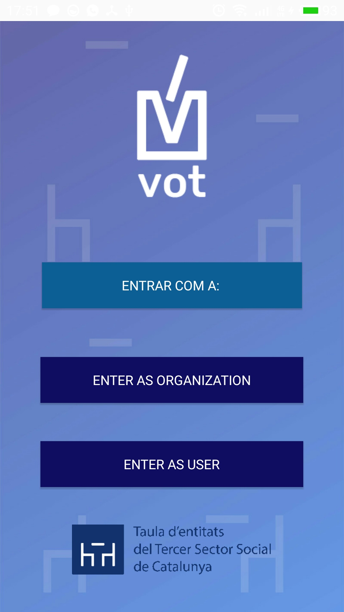
  
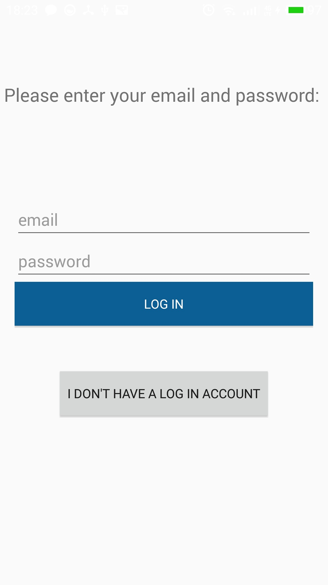

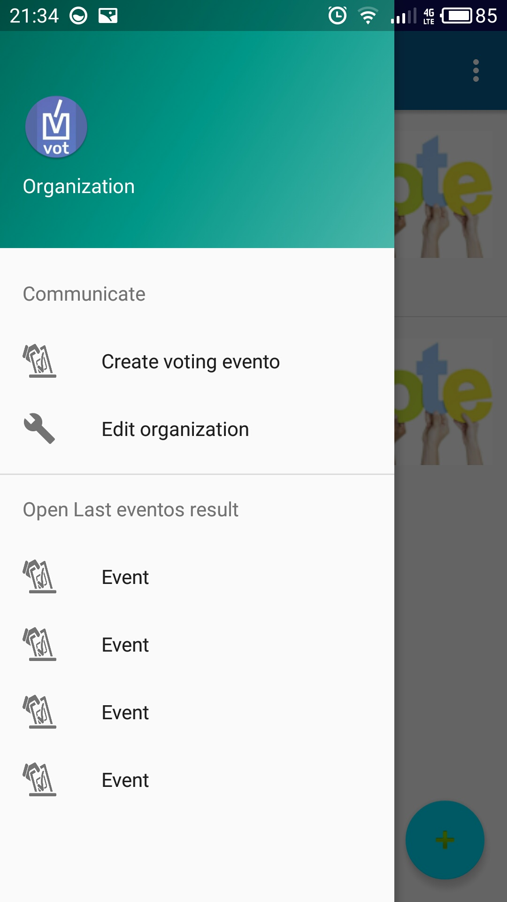
  
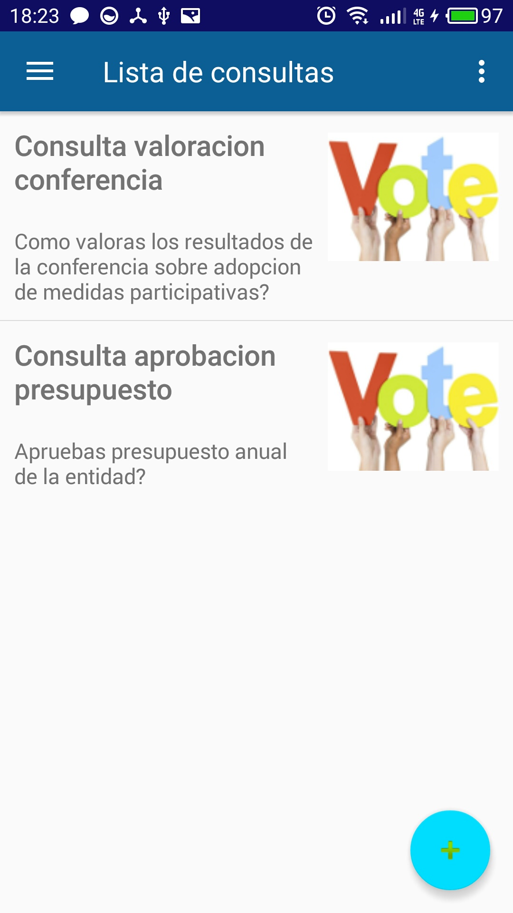

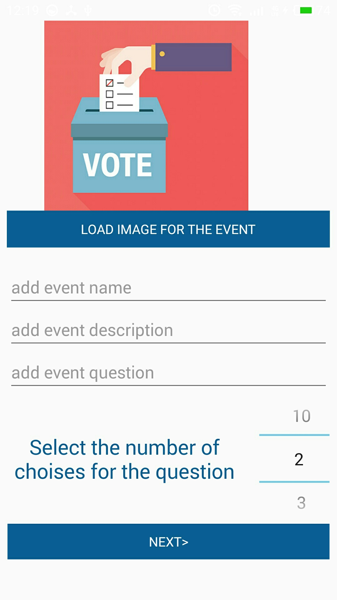
  

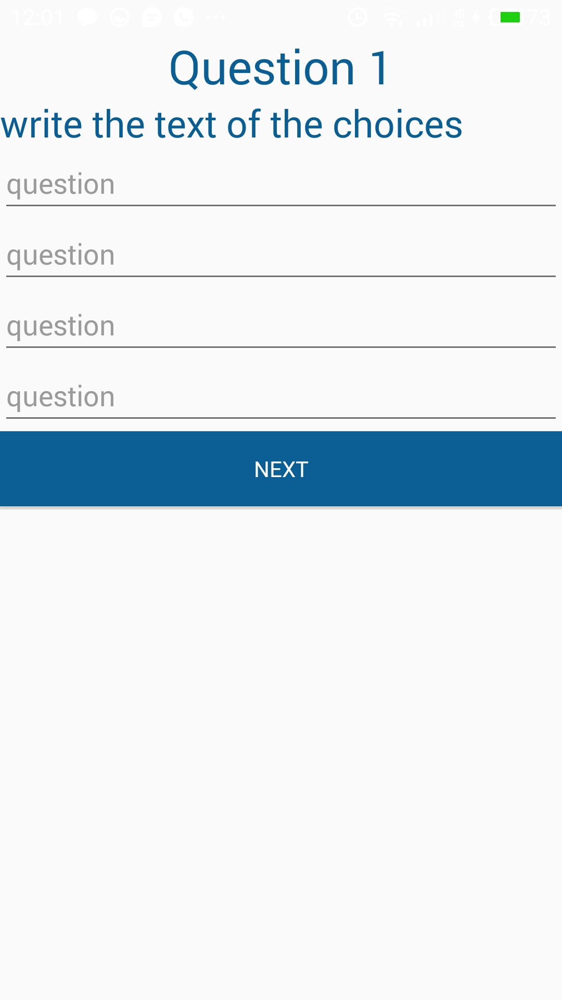
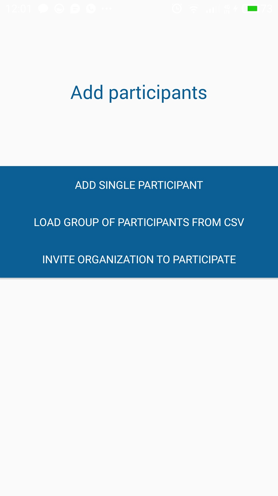  

  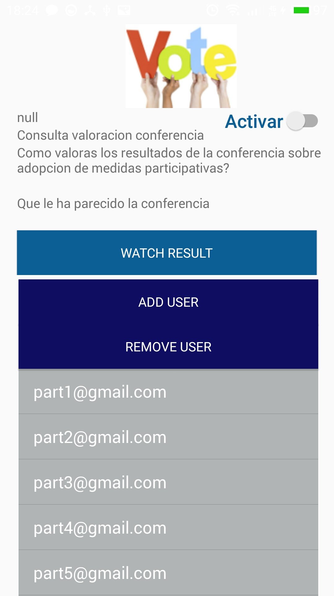

  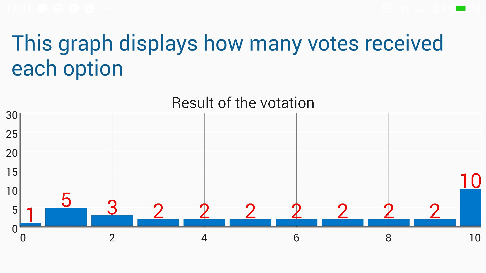

  
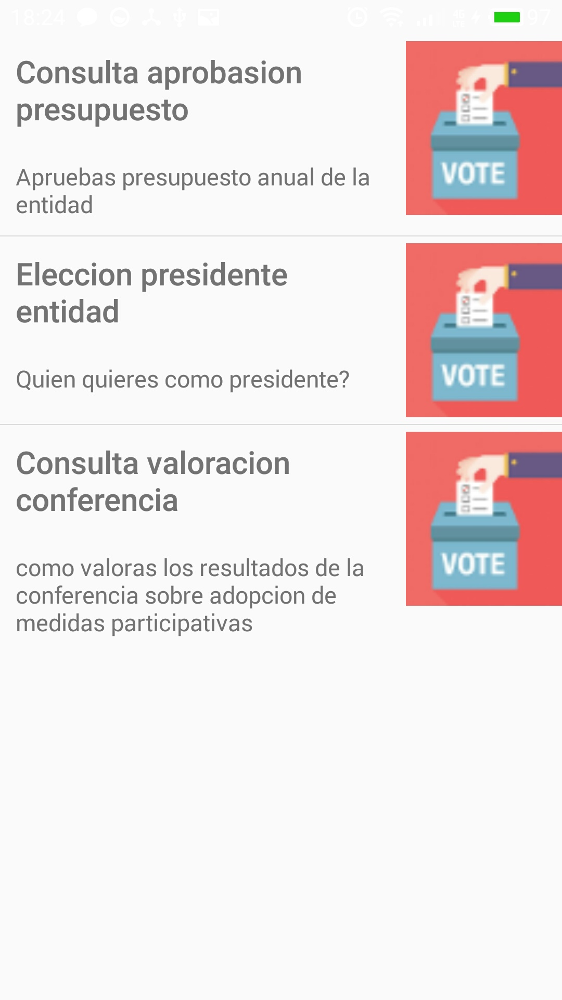
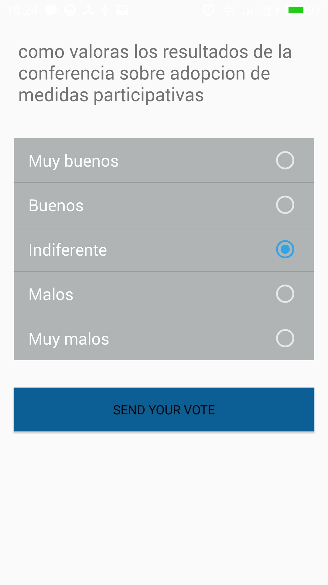

